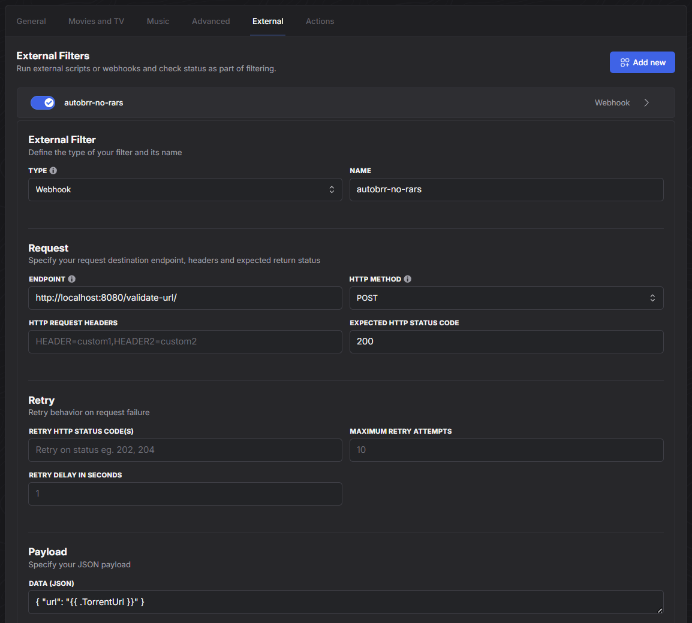

# API version
This method uses an API to take the URL of a `.torrent` file and check to see if the torrent contains any `.rar` files. If it contains too many `.rar` files for your liking, then it returns an error.

## Setup
You can use the `compose.yml` provided in this folder to quickly set up and start the container. Once that's done, open up your autobrr's webpage and select the "Filters" menu item. Pick a filter that you want to run this check on, then go to the "External" tab. Hit "Add new", then fill in the following information:

1. Type: `Webhook`
2. Name: \<whatever you want>
3. Host: `http://localhost:8080/validate-url` (Note the lack of trailing slash here!)
4. HTTP Method: `Post`
5. Headers: none, leave blank
6. Data (JSON): `{ "url": "{{ .TorrentUrl }}" }`
7. Expected HTTP status: `200`

**Remember to change the URL in the "Host" field to however you access your container.** If you expose the port on the same host as your autobrr instance, then the `compose.yml` example provided will work. If you use a separate machine or a reverse proxy, then you'll have to update it accordingly. All that matters is that you use the `/validate-url` endpoint. Then hit save. Here's how it should look:

### Allow some `.rar` files
By default, the API will check the torrent file for any `.rar` files and return an error if it finds one. But if for some reason you want to permit a certain number of rar files, such as if you expect the sample is rar'd but not the content, then you can set a threshold for how many `.rar` files you are willing to tolerate. If you want to block a release with two `.rar` files but not one, then you would change the "Data (JSON)" field to `{ "url": "{{ .TorrentUrl }}", "tolerance": 1 }`. The value of the "tolerance" field is the maximum number of `.rar` files you will accept in a `.torrent` file. Allowed values are 0-255.

### TorrentLeech authentication
If you're going to be downloading torrents from TorrentLeech, you'll need to give the application your site username and password. Set the `tlUsername` and `tlPassword` environment variables to allow the application to validate torrents from TorrentLeech.

### Customize server port
Simply set the `serverPort` environment variable to a valid port number. Check the logs if you're having trouble with this.

## How it works
The "Data (JSON)" you configured will send the URL of the `.torrent` file that Autobrr wants to process. The API will receive that torrent file and try to download it after doing some validation to ensure the URL is accessible and that it points to a `.torrent` file. Once it's downloaded, the API will check the metadata of the torrent for any files that end in `.rar`. If it finds more `.rar` files than the tolerance (which defaults to zero), then it returns an HTTP 418.