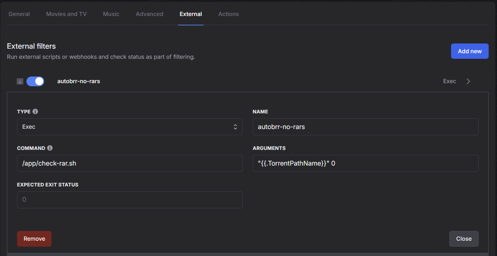

# Standalone version
This method takes the latest [autobrr](https://github.com/autobrr/autobrr) release, adds a binary to inspect torrent metadata, and adds a script that uses that binary to check if any torrent files from a filter contain files within that end in `.rar`.

## Setup
To ensure that no releases are passed to an action if they contain a `.rar` file, go to the "External" tab of your filter(s). Fill out the following information in the "Script" section of the page:

1. Type: `Exec`
2. Name: \<whatever you want>
3. Command: `/app/check-rar.sh`
4. Arguments: `"{{.TorrentPathName}}" 0`
5. Expected exit status: `0`

Then hit save. Here's how it should look:

### Allow some `.rar` files
If for some reason you want to permit a certain number of rar files, such as if you expect the sample is rar'd but not the content, then you can set a threshold for how many `.rar` files you are willing to tolerate for a release. To do this, simply change the second argument provided from a `0` to whatever number you like. If you want to block a release with two `.rar` files but not one, then you would put `1` since that is the maximum number of `.rar` files you will accept.

## How it works
This container does two things: downloads a binary of [intermodal](https://github.com/casey/intermodal), which lets us view metadata about torrent files, and it also copies in the validator script. The script uses that `intermodal` binary to dump some JSON metadata about the torrent file that we're evaluating. The script scans the "files" array of that JSON metadata for anything ending in `.rar`. The script exits silently if none are found but exits with an error if it does find anything, which autobrr will notice and ignore the release.
